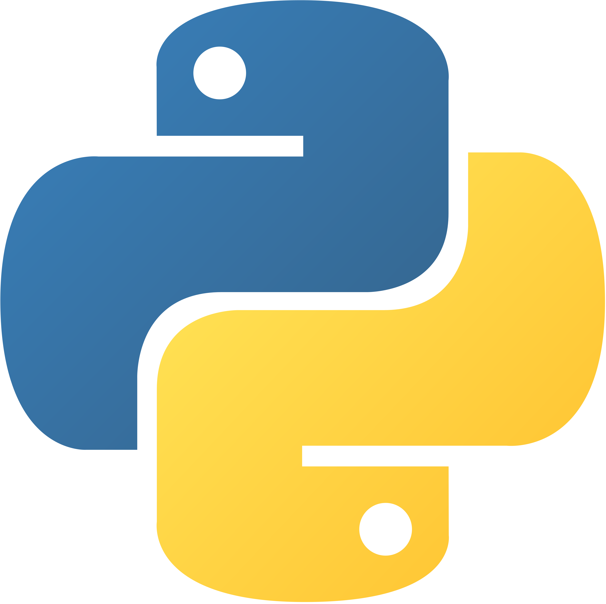
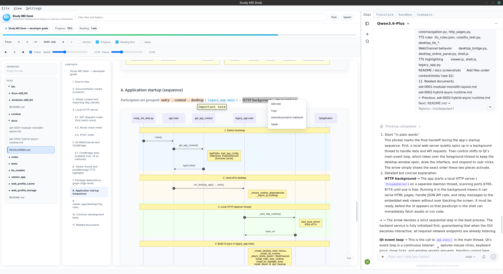
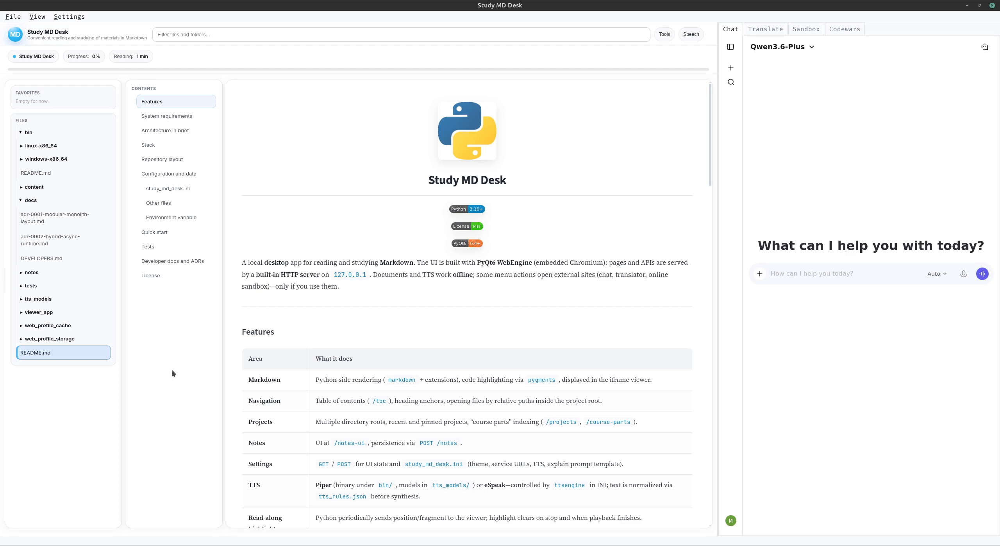
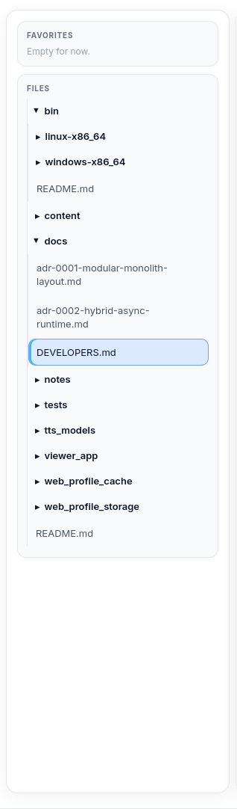
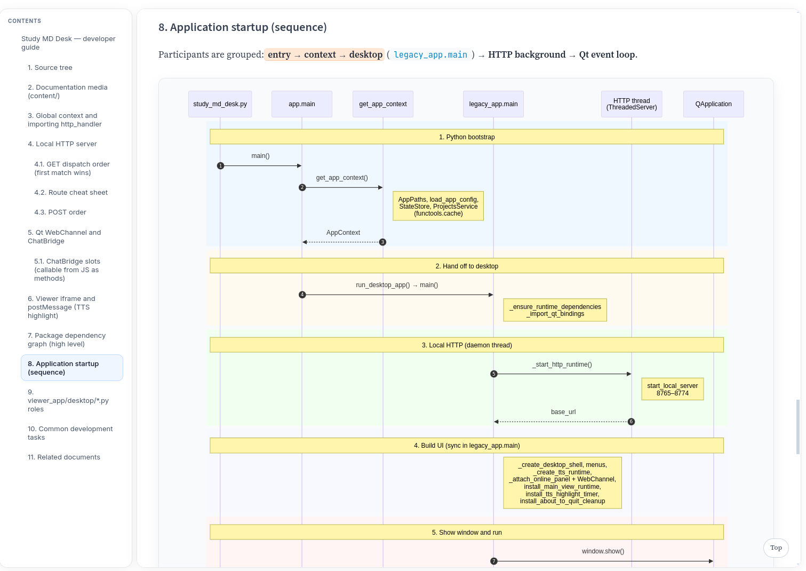
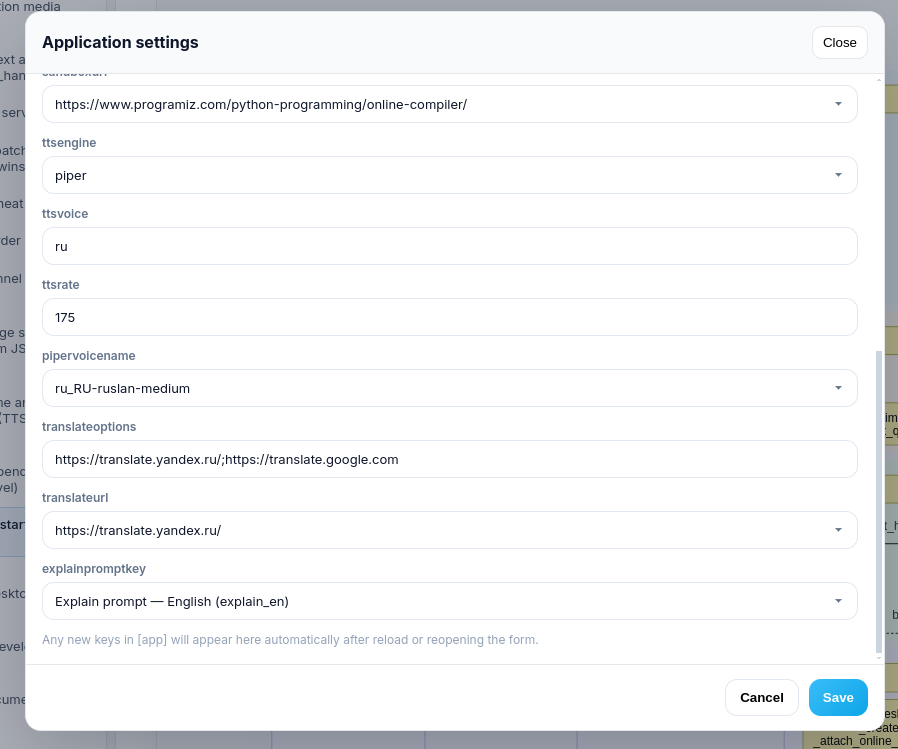
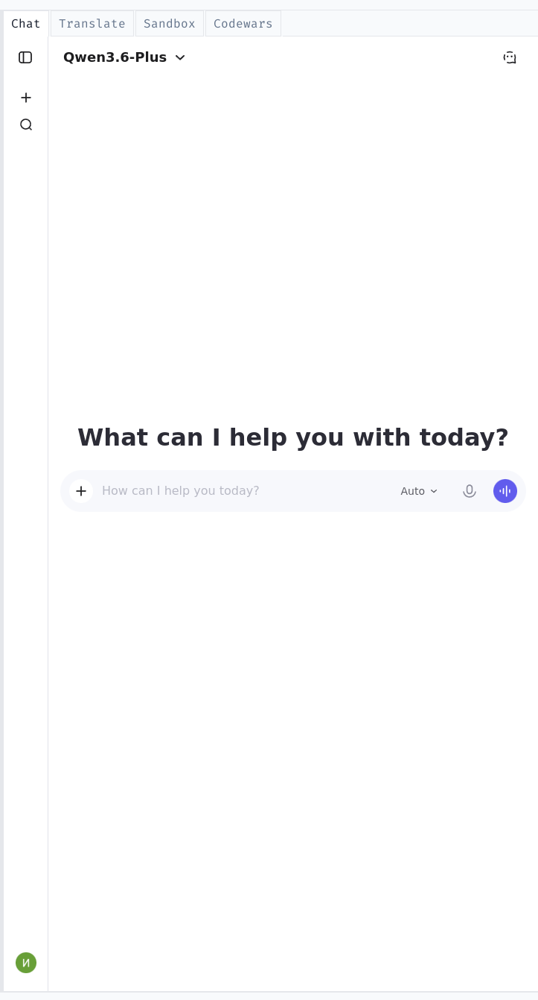
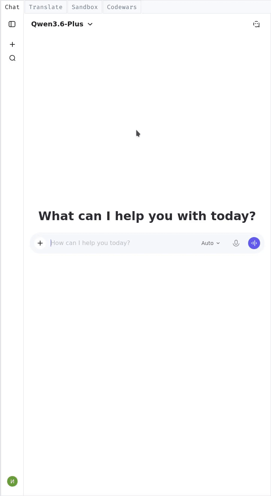

<div align="center">
  
  <h1><b>Study MD Desk</b></h1>
  <p>
    
    
    
  </p>
</div>

A local **desktop** app for reading and studying **Markdown**. You work in one window: a file tree, an outline of headings, the lesson in the center, and optional panels for notes, speech, a small Python runner, or external sites. Lessons and speech run **offline** once set up; chat, translator, or sandbox pages open only if you use those side tabs or menu links.

---

<div align="center">
  
</div>

*Demonstration: scrolling and reading a rendered Markdown lesson in the main document pane (code, lists, and special block types are formatted by the app’s built-in renderer).*

---

## Contents

- [Features](#features)
- [Screenshots & demos](#screenshots--demos)
- [System requirements](#system-requirements)
- [How it fits together](#how-it-fits-together)
- [Stack](#stack)
- [Repository layout](#repository-layout)
- [Configuration and data](#configuration-and-data)
- [Quick start](#quick-start)
- [Tests](#tests)
- [Documentation for developers](#documentation-for-developers)
- [License](#license)

---

## Features

| Area | What it does |
|------|----------------|
| **Markdown** | Renders study materials with readable typography: headings, lists, tables, **syntax-highlighted** code, **step-by-step / algorithm** blocks, callouts, task lists, and other enhancements so long explanations stay scannable. |
| **Navigation** | **Contents** column lists headings in the open file; you can jump to a section or follow links to other files **inside the same project folder**. |
| **Projects** | Several **course roots** (folders) are supported: pick a root, pin favorites, keep **recent** projects, and index multi-part courses so the right files are easy to open. |
| **Notes** | Select text in a lesson, add a short **note** with an excerpt from the selection; open or delete notes from the same context menu when the selection matches a saved note. |
| **Settings** | One **Settings** window edits the app profile: theme, title, speech engine, voices, optional URLs for online tools, and which explain-template language to use when you copy a prompt for an external chat. |
| **TTS (text-to-speech)** | **Listen** to the document or selection with **Piper** (offline voices from bundled or added models) or **eSpeak**; optional **follow** mode keeps the spoken phrase visible; you can adjust speed and pauses. Text is normalized before speech so numbers and symbols sound cleaner. |
| **Read-along** | While speech is playing, the viewer can **highlight** the phrase being read; highlighting stops when you stop playback or when reading finishes. |
| **Python from the UI** | A compact **Interpreter** panel runs **sandboxed** Python snippets next to the reader (useful for quick tries from a tutorial). |
| **Online panel** | Extra **tabs** beside the reader can show a chat, translator, or playground site you configure; the app can pass text (for example, a question) from the page into chat when you ask it to. |

Wire formats, HTTP routes, WebChannel, and code entry points are documented for contributors in **[docs/DEVELOPERS.md](docs/DEVELOPERS.md)**—this README stays focused on **using** the app.

---

## Screenshots & demos

Below, each item matches a file under **`./content/shots/`** (still images) or **`./content/gifs/`** (short screen recordings). Together they walk through the same UI you get after **Quick start**.

### Opening and reading a document (`doc_content.gif`)

The clip at the **top of this README** shows the **central reader**: a Markdown file in the main pane, scrolling, and rendered text (including code-style fragments)—the core “study from `.md` files” flow. (The same file is embedded there as the hero demo.)

---

### Full layout at a glance (`main.png`)

Still capture of the **whole window**: **Favorites** and **Files** on the left, **Contents** (outline) beside them, the **document iframe** in the middle, and—when enabled—the **Interpreter** strip on the right. The strip under the title shows **reading metadata** (document title, current section, progress, reading time) when those pills are turned on.

<div align="center">
  
</div>

---

### Toolbar, Tools, and panel toggles (`toolbar.gif`)

Shows the **top bar**: filter field for the file tree, **Tools** (expands the **reader toolbar**: Focus mode, font size **A− / A / A+**, text **width**, mark **favorite** ★ or **completed** ✓, toggles for section/progress/reading-time pills and **Sepia**), **Speech** (opens the speech control strip), and the checkboxes that show or hide **Files**, **Contents**, **Document**, and **Interpreter**. *Focus* temporarily hides side panels so only the lesson stays on screen.

<div align="center">
  
</div>

---

### Structure in the viewer (`view_blocks.gif`)

Demonstrates **how the lesson is structured on screen**: using the **Contents** outline to jump, scrolling through **long sections**, and how the renderer formats dense material—e.g. **stepwise** (algorithm-style) blocks, **callouts**, and list layouts that keep procedures and bullet lists easier to scan than a plain wall of text.

<div align="center">
  
</div>

---

### Choosing a project root (`project_files.png`)

Screenshot of **project-related actions** (typically under **File**): opening a folder as the active **project**, picking from **recent** or **pinned** roots, so the **Files** tree and course index refer to the correct set of Markdown files.

<div align="center">
  
</div>

---

### Browsing files in the tree (`content_files.png`)

The **Files** sidebar: folders and Markdown files for the **current project**. Selecting a file loads it into the **reader** and refreshes **Contents** for that file.

<div align="center">
  
</div>

---

### Notes on a passage (`notes.gif`)

Recording of the **notes** flow: select a phrase in the document; from the **context menu**, choose **Add note**; the dialog shows the **excerpt** and your note text. Saving attaches the note to that place in the file. If a note already exists for that selection, the menu offers **Edit note** / **Delete note**.

<div align="center">
  
</div>

---

### Application settings — interaction (`settings.gif`)

Walkthrough of the **Application settings** modal: switching options (theme, speech, URLs, explain-template language, etc.) and **Save**—values are written to your **`study_md_desk.ini`** so the next launch (or reload) uses them.

<div align="center">
  
</div>

---

### Application settings — static view (`settings.png`)

Single frame of the same **settings** form, useful as a quick reference for which groups of options exist (appearance, speech, external links, prompts).

<div align="center">
  
</div>

---

### Text-to-speech controls (`tts.gif`)

The **Speech** strip: **play** (reads selection if any, otherwise the document flow), **pause / resume**, **stop**, **Follow** (sync highlight with the spoken chunk), sliders for **speed** and **pause between sentences**, plus the **Now reading** line. Together with the viewer, this shows **offline listening** and read-along behavior.

<div align="center">
  
</div>

---

### Online side panel (`online.png`)

Layout with the **online** area visible: the reader on one side and **extra browser tabs** (e.g. chat or translator) on the other. These pages are **optional** and only use the network when that tab is open and loaded.

<div align="center">
  
</div>

---

### Switching online tabs (`online_swap.gif`)

Short demo of **changing tabs** in the online area—moving between chat, translate, or other configured sites **without leaving** the main reader layout.

<div align="center">
  
</div>

---

### “Explain” prompt to the clipboard (`generate_prompts.gif`)

From a **text selection**, the **context menu** includes an action that **builds a long “tutor” prompt** (based on the section title, lesson text, and your selection), using templates shipped in **`prompts.json`**, and **copies it to the clipboard** so you can paste it into **your** AI chat in a browser. The app does **not** send this prompt by itself; it only prepares the text.

<div align="center">
  
</div>

---

## System requirements

- **Python** 3.12 or newer (developed and tested on **3.12.7**).
- Runtime packages from `requirements.txt` (**PyQt6**, **PyQt6-WebEngine**, **PyQt6-QtWebChannel**, **markdown**, **pygments**). Automated tests need `requirements-dev.txt` as well.
- On Linux, distro packages for **Qt / WebEngine** may be required (names vary).
- **Piper (offline voices):** put the **piper** binary under `bin/<platform>-<arch>/` (see **`bin/README.md`**) and voice files under `tts_models/` (see **`tts_models/README.md`**).
- **eSpeak:** install **`espeak`** or **`espeak-ng`** if you choose that engine in settings.

---

## How it fits together

The program is a **desktop shell** (menus, panels, speech) around an **embedded browser** view. That view loads a **local** page served only on your machine (`127.0.0.1` on a free port in the **8765–8774** range), which keeps file listings, settings, and document rendering in one place. You can study with local Markdown and TTS **without** the internet; optional side tabs reach the web only when you use them.

**Source layout, HTTP API, sandboxed Python, and extension points** are described in **[docs/DEVELOPERS.md](docs/DEVELOPERS.md)**.

---

## Stack

See **`requirements.txt`**. The UI expects **PyQt6** with **WebEngine** and **QtWebChannel**.

---

## Repository layout

| Path | Purpose |
|------|---------|
| `study_md_desk.py` | Launches the app. |
| `viewer_app/` | All application logic (desktop, HTTP, Markdown, projects, speech, web assets). |
| `bin/` | Bundled **Piper** builds (e.g. Linux and Windows x86_64). |
| `tts_models/` | Piper **voice** model files (`.onnx` + `.onnx.json`). |
| `content/` | **Screenshots and GIFs** for this README and other docs (`./content/shots/`, `./content/gifs/`). |
| `docs/` | Architecture notes and **[DEVELOPERS.md](docs/DEVELOPERS.md)**. |
| `notes/` | Sample note data (optional). |
| `tests/` | Unit tests (`test_*.py`), when present. |

The app also creates **cache/profile** folders at runtime (often git-ignored).

---

## Configuration and data

### `study_md_desk.ini`

Main config in the app **home directory** (next to the project or under **`MD_VIEWER_HOME`**). A filled-out sample is **`study_md_desk.ini.example`**.

Typical **`[app]`** options include: project root, window title, **theme**, URLs for optional online tools, **`ttsengine`** (`piper` or `espeak`), voice and rate fields, Piper voice name, and **`explainpromptkey`** (which template from **`prompts.json`** to use when generating the clipboard “explain” prompt).

Saving from the in-app **Settings** dialog updates this file and refreshes what the running app uses where applicable.

### Other files you may see

| File | Purpose |
|------|---------|
| `study_md_desk_state.json` | Remembers UI state (panels, recent paths, etc.). |
| `prompts.json` | Wording of the **explain** prompts (Russian / English templates). |
| `tts_rules.json` | Rules that **normalize** text before speech (numbers, symbols, abbreviations). |

### Environment variable

| Variable | Effect |
|----------|--------|
| `MD_VIEWER_HOME` | Puts **INI**, state, and optional copies of `prompts.json` / `tts_rules.json` (and caches) in that directory instead of the default. |

---

## Quick start

```bash
python3 -m venv .venv
source .venv/bin/activate   # Windows: .venv\Scripts\activate
pip install -r requirements.txt
python study_md_desk.py
```

If every port **8765–8774** is busy, close another copy of the app or free a port.

---

## Tests

Automated tests use **pytest** (see `requirements-dev.txt` and `pyproject.toml`):

```bash
pip install -r requirements-dev.txt
PYTHONPATH=. python -m pytest
```

---

## Documentation for developers

**[docs/DEVELOPERS.md](docs/DEVELOPERS.md)** — module map, **HTTP** handlers, **WebChannel** bridge, messages between shell and viewer, TTS wiring, and diagrams for anyone **changing or integrating** the codebase. End-user material stays in **this README**.

---

## License

MIT. See `LICENSE`.
