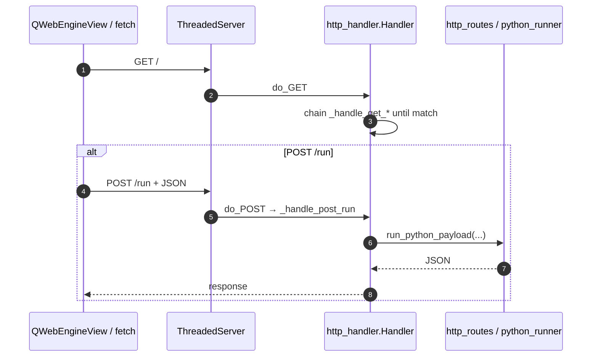
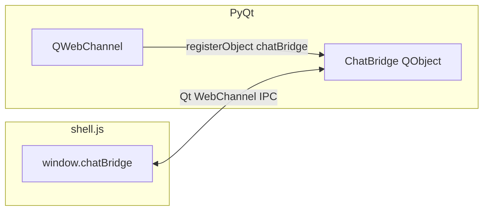
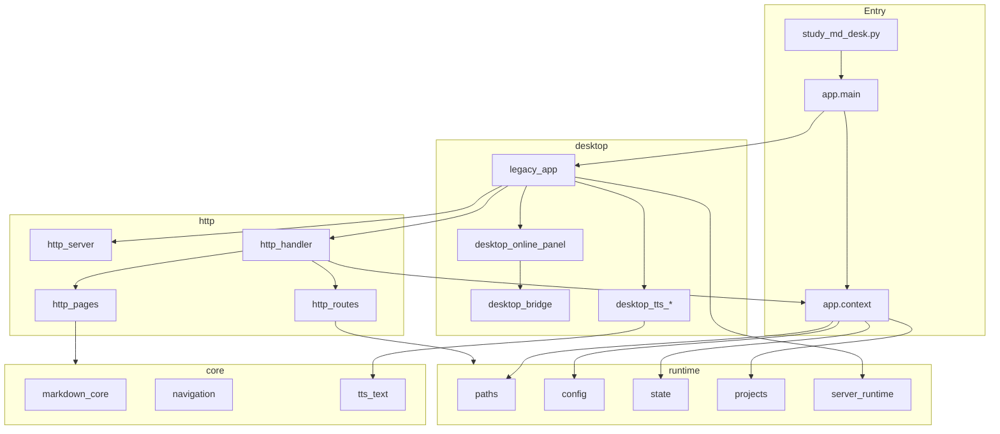
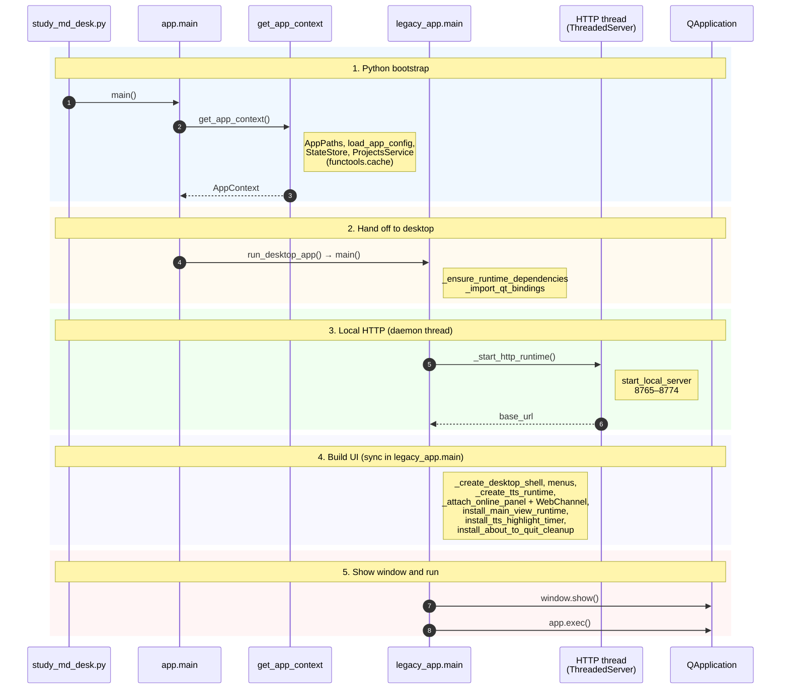

# Study MD Desk — developer guide

This document is a **code map**: layout, HTTP layer, **Qt WebChannel**, **viewer** iframe messaging, TTS, and common extension points.

Architectural background: [adr-0001-modular-monolith-layout.md](adr-0001-modular-monolith-layout.md), [adr-0002-hybrid-async-runtime.md](adr-0002-hybrid-async-runtime.md), [adr-0003-embedded-web-ui-dual-ipc.md](adr-0003-embedded-web-ui-dual-ipc.md) (local HTTP shell, iframe viewer, WebChannel + `postMessage`).

---

## 1. Source tree

Ignored here: `.git/`, `.venv/`, `__pycache__/`, WebEngine profile caches (`web_profile_cache/`, `web_profile_storage/`). Under `bin/*/piper/` are third-party Piper binaries — see `bin/README.md`.

```text
.
├── bin/                          # Piper: linux-x86_64, windows-x86_64
├── content/                      # Images, GIFs for README / docs (see §2)
│   ├── shots/                    # Screenshots, icons
│   └── gifs/                     # Short UI demos (recordings)
├── docs/                         # ADR, contracts, DEVELOPERS.md
├── notes/
├── tests/
├── tts_models/                   # ONNX + *.onnx.json
├── viewer_app/
│   ├── __init__.py
│   ├── app/
│   │   ├── context.py            # AppContext, get_app_context() (@cache)
│   │   └── main.py               # main() → get_app_context(); run_desktop_app()
│   ├── core/
│   │   ├── markdown_core.py      # MD → HTML
│   │   ├── navigation.py         # TOC / structure
│   │   └── tts_text.py           # TtsTextPipeline, tts_rules.json
│   ├── desktop/
│   │   ├── legacy_app.py         # desktop main(), HTTP, menus, TTS timer
│   │   ├── desktop_bridge.py     # ChatBridge, pyqtSlot API for JS
│   │   ├── desktop_online_panel.py  # tabs, QWebChannel, registerObject
│   │   ├── desktop_tts_orchestrator.py, desktop_tts_controllers.py
│   │   ├── desktop_tts_controls.py, desktop_tts_state.py
│   │   ├── desktop_actions.py, desktop_file_menu.py, desktop_view_menu.py
│   │   ├── desktop_lifecycle.py, desktop_runtime.py, desktop_theme.py
│   │   ├── desktop_doc_loading_overlay.py, desktop_web_helpers.py
│   │   └── __init__.py           # run_desktop_app() → legacy_app.main
│   ├── http/
│   │   ├── http_server.py        # ThreadedServer
│   │   ├── http_handler.py       # Handler, do_GET / do_POST
│   │   ├── http_routes.py        # API payloads, business logic
│   │   └── http_pages.py         # build_shell_html, view, toc, assets
│   ├── runtime/
│   │   ├── paths.py              # AppPaths, MD_VIEWER_HOME
│   │   ├── config.py             # INI, prompts
│   │   ├── state.py              # StateStore
│   │   ├── projects.py           # ProjectsService
│   │   ├── python_runner.py      # sandboxed code execution
│   │   └── server_runtime.py     # start_local_server(8765, 8775)
│   └── web/
│       ├── web_assets/           # shell.js, viewer.js, *.css
│       └── web_notes_ui.py
├── prompts.json
├── study_md_desk.py
├── study_md_desk.ini.example
├── tts_rules.json
└── (runtime) study_md_desk.ini, study_md_desk_state.json
```

---

## 2. Documentation media (`content/`)

The **`content/`** directory holds **binary assets for Markdown only** (not loaded by the application at runtime). Typical files: **PNG/WebP screenshots**, **GIF** demos, icons.

| Location | Use |
|----------|-----|
| `content/shots/` | Screenshots, repo icon |
| `content/gifs/` | Short UI demos (GIF recordings) |

**Relative paths:**

- In **`README.md`** (repository root): `./content/shots/…`, `./content/gifs/…`
- In **`docs/*.md`**: `../content/shots/…`, `../content/gifs/…`

Commit media only when it meaningfully helps readers; prefer small, compressed files.

---

## 3. Global context and importing `http_handler`

On **first import** of `viewer_app.http.http_handler` the module runs:

```text
_APP_CONTEXT = get_app_context()
```

It then keeps `_APP_PATHS`, `_STATE_STORE`, `_PROJECTS_SERVICE`. That must match the context already built by `app.main.main()` in the same process — a single cached `get_app_context()`.

---

## 4. Local HTTP server

- **`server_runtime.start_local_server`**: tries `range(8765, 8775)` → ports **8765–8774**.
- **`ThreadedServer`**: per-request threads; `serve_forever` runs in a **daemon** thread (`server_runtime.py`).
- **`Handler`**: subclasses `SimpleHTTPRequestHandler`, serves HTML/JSON/files.

### 4.1. `GET` dispatch order (first match wins)

`Handler.do_GET` in `http_handler.py` chains `_handle_get_*` with `or`:

1. `_handle_get_notes(qs)` — only if path is **`/notes`**; response body depends on **query** (`build_notes_get_payload`).
2. `_handle_get_app_config(path)` — `/app-config`.
3. `_handle_get_piper_voices(path)` — `/piper-voices`.
4. `_handle_get_projects(path)` — `/projects`.
5. `_handle_get_course_parts(path, qs)` — `/course-parts`.
6. `_handle_get_notes_ui(path)` — `/notes-ui`.
7. `_handle_get_shell(path, query)` — path **`""`** or **`"/"`** (shell).
8. `_handle_get_toc(path, query)` — `/toc`.
9. `_handle_get_assets(path)` — prefix **`/assets/`**.
10. `_handle_get_view(path, query)` — prefix **`/view/`**.
11. Otherwise **404**.

### 4.2. Route cheat sheet

| Method | Path (examples) | Role |
|--------|------------------|------|
| GET | `/` | HTML shell (`build_shell_html`). |
| GET | `/toc`, `/view/...`, `/assets/...` | TOC, document view, static assets. |
| GET | `/notes` | Notes JSON (with query). |
| GET | `/app-config`, `/piper-voices`, `/projects`, `/course-parts` | JSON APIs. |
| GET | `/notes-ui` | Notes UI HTML. |
| POST | `/run` | Run Python (`run_python_payload`). |
| POST | `/app-settings` | Merge into INI + `reload_config()`. |
| POST | `/settings` | Patch `StateStore`. |
| POST | `/notes` | Save notes. |
| POST | `/projects` | Project actions (pin, recent, active). |

Exact request/response shapes live in `http_handler.py` and `http_routes.py`.

### 4.3. `POST` order

`do_POST`: `/run` → `/app-settings` → `/settings` → `/notes` → `/projects` → else 404.



---

## 5. Qt WebChannel and `ChatBridge`

Registration in **`desktop_online_panel.py`**: create `QWebChannel`, then:

```text
web_channel.registerObject("chatBridge", chat_bridge)
_shell_page.setWebChannel(web_channel)
```

In **`shell.js`**, after `qwebchannel.js` loads: `channel.objects.chatBridge` is stored as **`window.chatBridge`**.

### 5.1. `ChatBridge` slots (callable from JS as methods)

JS names match PyQt slot names (camelCase):

| Slot | Purpose |
|------|---------|
| `askInChat(prompt)` | Send text to the active chat tab. |
| `copyToClipboard(text)` | Copy via host clipboard handler. |
| `ttsSpeakText(text)` | Speak a text fragment. |
| `ttsSetPiperVoice(voice_id)` | Switch Piper voice. |
| `ttsSpeakCurrentDoc()` | Speak current document (host logic). |
| `ttsTogglePause()`, `ttsStop()` | Pause / stop. |
| `ttsGetSpeed()` / `ttsAdjustSpeed(delta)` / `ttsSetSpeed(value)` | Speed. |
| `ttsGetSentenceSilence()` / `ttsSetSentenceSilence(value)` | Pause between sentences. |
| `notesGoToAnchor(anchor)` | Injects `mdViewerScrollToAnchor` in viewer. |
| `notesFindInDoc(text)` | `mdViewerFindInDoc`. |
| `notesOpenDoc(rel_path, root)` | `mdViewerOpenByPath`. |
| `docContentLoading(active)` | Document load indicator in shell. |
| `setChatTheme(theme)` | Qt theme + localStorage on supported chat hosts. |

Callbacks are wired through **`BridgeActions`** in the same module.



---

## 6. Viewer iframe and `postMessage` (TTS highlight)

Document HTML lives in a **nested frame**; the shell forwards messages with `contentWindow.postMessage`.

Protocol (see **`viewer.js`**, **`shell.js`**):

| `data.type` | Meaning |
|-------------|---------|
| `tts-highlight` | Show/update highlight (position/text; viewer parses). |
| `tts-highlight-clear` | Clear highlight (queue finished, stop, etc.). |

CSS classes include **`tts-highlight`**, **`tts-highlight-sentence`**.

Python: timer and dispatch in **`legacy_app.py`** (`install_tts_highlight_timer`, `dispatch_tts_highlight`); playback end in **`desktop_tts_controllers`** → host clears via the same messaging path.

---

## 7. Package dependency graph (high level)



---

## 8. Application startup (sequence)

Participants are grouped: **entry** → **context** → **desktop** (`legacy_app.main`) → **HTTP background** → **Qt event loop**.



---

## 9. `viewer_app/desktop/*.py` roles

| File | Role |
|------|------|
| `legacy_app.py` | Wires desktop: HTTP, window, menus, TTS runtime, highlight timer, exit cleanup. |
| `desktop_online_panel.py` | External tabs, **QWebChannel**, shell page hookup. |
| `desktop_bridge.py` | **`ChatBridge`**, `BridgeActions`, chat theme sync. |
| `desktop_tts_orchestrator.py` | Speech orchestration. |
| `desktop_tts_controllers.py` | Piper/eSpeak, queue, position events, **playback finished**. |
| `desktop_tts_controls.py` | UI commands → controllers. |
| `desktop_tts_state.py` | TTS state. |
| `desktop_file_menu.py` | File menu, projects, open MD. |
| `desktop_view_menu.py` | View menu, zoom, panels. |
| `desktop_actions.py` | Connects menus and web actions. |
| `desktop_lifecycle.py` | Page lifecycle, cache-busted URLs. |
| `desktop_runtime.py` | View runtime helpers. |
| `desktop_theme.py` | Qt / shell themes. |
| `desktop_doc_loading_overlay.py` | Loading overlay. |
| `desktop_web_helpers.py` | WebEngine utilities. |

---

## 10. Tests (pytest + coverage)

Install dev dependencies and run the suite from the repository root:

```bash
pip install -r requirements-dev.txt
PYTHONPATH=. python3 -m pytest
```

- Configuration: `pyproject.toml` (`[tool.pytest.ini_options]`, `[tool.coverage.*]`).
- **`fail_under = 90`** applies to **line** coverage (branch coverage is disabled for the gate so the threshold stays meaningful without PyQt-heavy modules).
- Measured sources omit:
  - `viewer_app/desktop/*` (PyQt / WebEngine UI — use manual or dedicated GUI harnesses),
  - `viewer_app/core/markdown_core.py` and `viewer_app/core/tts_text.py` (large text engines; still exercised indirectly via `md_to_html`, HTTP view routes, and `TtsTextPipeline` tests).

The rest of `viewer_app`, plus `study_md_desk.py`, is expected to stay at or above the threshold.

---

## 11. Common development tasks

| Task | Where to look |
|------|----------------|
| New JSON API | `http_routes.py` + new `_handle_get_*` / `_handle_post_*` + route in `do_GET`/`do_POST`. |
| Shell / viewer markup | `http_pages.py`, `web_assets/shell.js`, `viewer.js`. |
| Markdown / TOC | `core/markdown_core.py`, `core/navigation.py`, `http_pages.py`. |
| TTS rules | `tts_rules.json`, `core/tts_text.py`, `desktop_tts_*`. |
| WebChannel behavior | `desktop_bridge.py`, `desktop_online_panel.py`, `shell.js`. |
| TTS highlighting | `viewer.js`, `shell.js`, `legacy_app.py`. |
| README / docs screenshots | Add files under `content/shots/` (see §2). |

---

## 12. Related documents

- [adr-0001-modular-monolith-layout.md](adr-0001-modular-monolith-layout.md)
- [adr-0002-hybrid-async-runtime.md](adr-0002-hybrid-async-runtime.md)
- [adr-0003-embedded-web-ui-dual-ipc.md](adr-0003-embedded-web-ui-dual-ipc.md)